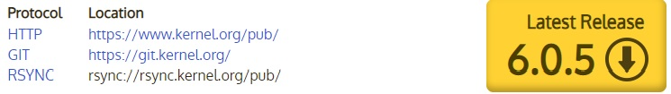

# Обновление ядра в centos7
На момент написания мануала последнее стабильное ядро Linux - 6.0.5. Автор собирал из исходников именно эту версию ядра, из репозитория устанавливалось ядро версии 6.0.4. 

---
## Обновление ядра из репозитория
#### Цели:
- Обновить ядро из репозитория;
- Смонтировать `virtualbox shared folders` при поднятии машины через `Vagrant`.
#### Исходные данные:
- Виртуальная лаборатория на `Vagrant`:
  - **VirtualBox** - среда виртуализации, позволяет создавать и выполнять виртуальные машины;
  - **Vagrant** - ПО для создания и конфигурирования виртуальной среды. В данном случае в качестве среды виртуализации используется `VirtualBox`;
  - **Git** - система контроля версий
- Данный репозиторий:
  - `Vagrantfile` - файл описывающий виртуальную инфраструктуру для `Vagrant`.   
---
### Решение задачи:

#### Устанавливаем свежеее ядро из репозитория
Подключаем репозиторий, откуда возьмем необходимую версию ядра:

    sudo yum install -y http://www.elrepo.org/elrepo-release-7.0-3.el7.elrepo.noarch.rpm

В репозитории есть две версии ядер **kernel-ml** и **kernel-lt**. Первая является наиболее свежей стабильной версией, вторая это стабильная версия с длительной поддержкой, но менее свежая, чем первая. В данном случае ядро 6-й версии будет в **kernel-ml**.

Поскольку мы ставим ядро из репозитория, то установка ядра похожа на установку любого другого пакета, но потребует явного включения репозитория при помощи ключа `--enablerepo`:

    sudo yum --enablerepo elrepo-kernel install kernel-ml -y
    
После успешной установки нам необходимо сказать системе, что при загрузке нужно использовать новое ядро. В случае обновления ядра на рабочих серверах необходимо перезагрузиться с новым ядром, выбрав его при загрузке. И только при успешно прошедших загрузке нового ядра и тестах сервера переходить к загрузке с новым ядром по-умолчанию. В тестовой среде можно обойти данный этап и сразу назначить новое ядро по-умолчанию.  

Обновляем конфигурацию загрузчика:    
    
    sudo grub2-mkconfig -o /boot/grub2/grub.cfg
    
Выбираем загрузку с новым ядром по-умолчанию:

    sudo grub2-set-default 0
    
#### Перезагружаем машину, смотрим вывод загрузки    
    vagrant reload

---

    VirtualBox Guest Additions: Building the VirtualBox Guest Additions kernel 
    modules.  This may take a while.   
    VirtualBox Guest Additions: To build modules for other installed kernels, run  
    VirtualBox Guest Additions:   /sbin/rcvboxadd quicksetup <version>  
    VirtualBox Guest Additions: or  
    VirtualBox Guest Additions:   /sbin/rcvboxadd quicksetup all  
    VirtualBox Guest Additions: Kernel headers not found for target kernel   
    6.0.4-1.el7.elrepo.x86_64. Please install them and execute  
    /sbin/rcvboxadd setup  
    modprobe vboxguest failed  
    The log file /var/log/vboxadd-setup.log may contain further information.  
---
Видим, что не устанавливаются kernel modules. Нужны kernel headers для нового ядра, а также в логе `/var/log/vboxadd-setup.log` видим ошибки из-за версии `gcc`, которая должна быть 9.3.0 для сборки нового ядра.

При этом ядро в нашей системе

    uname -r
    6.0.4-1.el7.elrepo.x86_64

#### Установим `Kernel headers` для ядра 6.0.4-1.el7.elrepo.x86_64

    sudo yum remove kernel-headers
    sudo yum --enablerepo elrepo-kernel install kernel-ml-headers.x86_64 kernel-ml-devel.x86_64    
    
#### Установим `gcc` версии 9.3.0 из исходников

Установим необходимые пакеты для сборки
    
    sudo yum -y install bzip2 wget gcc gcc-c++ gmp-devel mpfr-devel libmpc-devel make
    
Скачаем исходники и распакуем их:    
    
    wget http://mirror.linux-ia64.org/gnu/gcc/releases/gcc-9.3.0/gcc-9.3.0.tar.gz
    tar -xvf gcc-9.3.0.tar.gz
    
Перейдем в созданную директорию:

    cd gcc-9.3.0/
    
Соберем `gcc`:    
    
    ./configure --enable-languages=c,c++ --disable-multilib
    make -j$(nroc)
    sudo make install
    
Проверим версию `gcc`:    
    
    gcc --version
      gcc (GCC) 9.3.0  
      
#### Перезагружаем машину через `vagrant`, видим корректное монтирование `vbox shared folders`

    vagrant reload  
    
    ==> centos7-002: Mounting shared folders...  
    centos7-002: /vagrant => /mnt/lvm_4/vagrant/centos7-002  
    ==> centos7-002: Machine already provisioned. Run `vagrant provision` or use the `--provision`  
    ==> centos7-002: flag to force provisioning. Provisioners marked to run always will still run.  
    
#### Готово!    

---
## Обновление ядра из репозитория
#### Цели:
- Обновить ядро из репозитория;
- Смонтировать `virtualbox shared folders` при поднятии машины через `Vagrant`.
#### Исходные данные:
- Виртуальная лаборатория на `Vagrant`:
  - **VirtualBox** - среда виртуализации, позволяет создавать и выполнять виртуальные машины;
  - **Vagrant** - ПО для создания и конфигурирования виртуальной среды. В данном случае в качестве среды виртуализации используется `VirtualBox`;
  - **Git** - система контроля версий
- Данный репозиторий:
  - `Vagrantfile` - файл описывающий виртуальную инфраструктуру для `Vagrant`.   
---
### Решение задачи:

